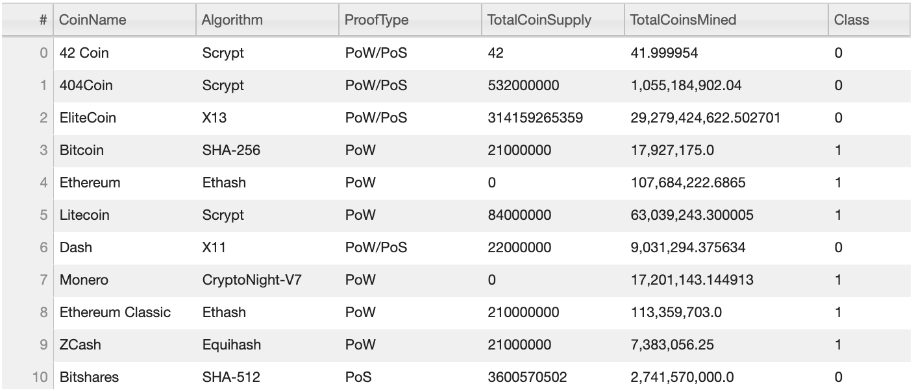

# Cryptocurrencies

## Purpose and Accomplishments
With this challenge, we learned what unsupervised learning is used for, how to process data, how to cluster, how to reduce dimensions, and how to reduce the principal components using PCA. After learning these skills, we created an analysis for our clients who are preparing to invest time into the cryptocurrency market. One of the senior managers from Accountability Accounting is interested in offering a new cryptocurrency investment portfolio for its customers. Because of this recent interest, we have been asked to create a report that includes what cryptocurrrencies are on the trading market and how they could be grouped to create a classification system for this new investment.

Below are some images to present some of the data we processed from this analysis:

**PCA - Three Principal Components**

**Elbow Curve to find best value for K**

**3D-Scatter with Clusters**

**Tradable Cryptocurrencies Table**

**Scatter Plot with x = Total Coins Mined and y = Total Coin Supply**

